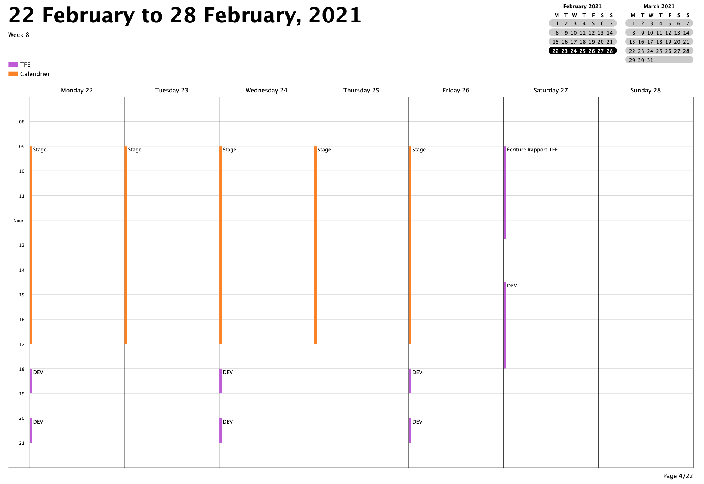

# Défense Technique 22/01/2021

>Martin Michotte - HE302955
## Titre du TFE : 
Conception et réalisation d'une application web de gestion de la supply-chain pour la société *SLG Classic Cars. (restauration de véhicules anciens)*

## Objectifs
Le client, [SLG Classic Cars](https://www.slgcars.be), est un petite société familiale de restauration et entretien de voitures anciennes. Ils utilisent actuellement une combinaison de 2 logiciels (*[GAD-Garage](https://www.logiciel-garage.fr)* + *SLG-order-manager* (logiciel propriétaire) ) afin de répondre à leurs besoins, à savoir :
* Gestion des clients
* Gestion des fournisseurs
* Gestion des véhicules
* Gestion du stock
* Gestion des commandes 
* Gestion des factures 
* Gestions des devis 
* Gestion des fiches de travail
* ... 

Le logiciel *GAD-garage* ne leur convenant plus, la société souhaite développer une nouvelle solution informatique spécialement adaptée à leur façon de travailler et répondant à leurs besoins cités-ci avant. 

Cette solution devra être conçue de façon à pouvoir être adaptée au fil des années en fonction des nouveaux besoins du client. De plus, afin de garantir une utilisation à distance ainsi qu'une grande flexibilité, le client souhaite que la solution soit articulée autour d'une application web. 

--- 

## Methodologie

La méthodologie que j'ai choisie pour ce TFE s'articule principalement autour de la méthodologie `Agile`. J'ai commencé par définir, au travers de nombreuses de réunions avec le client, les grandes fonctionnalités de ce projet. Sur base de ces informations j'ai pu choisir les technologies et mettre en place la structure du projet ainsi que tous les outils nécessaires au développement de celui-ci. 

Les fonctionnalités du projet sont toutes découpées en User-stories. Néanmoins le projet dans sa globalité étant assez conséquent, le détail de chaque user-story se fera petit à petit. Mon workflow sera donc le suivant: 
1. En collaboration avec le client, deux ou trois user-stories sont détaillées.
2. J'implémente complètement ces user-stories.
3. Les fonctionnalités (US) ajoutées sont validées ou non par le client.
4. Modification au besoin de ces fonctionnalités en fonction des remarques du client.
5. Retour au point 1. 

Ce workflow me permet donc de ne pas "perdre" du temps à détailler des User-Stories qui au final de seront pas implémentées par manque de temps. 

--- 

## Planning
La réalisation du TFE devant se faire en même temps que le stage, j'ai décidé de travailler selon le planning suivant: 

Notons que ce planning représente une semaine type mais qu'il peut varier légèrement de semaine en semaine. A titre d'exemple, l'écriture du TFE ne se fera qu'une semaine sur deux et non chaque samedi. 

## État d'avancement 
Afin de facilement pouvoir consulter l'avancement du projet j'ai créé une `ToDo-list`consultable [ici](https://github.com/MMichotte/SLG_APP/blob/master/docs/ToDo.md). En voici un extrait reprenant les grandes étapes:
- [X] Description de la société (client)
- [X] Description du projet
>
- [ ] Analyse des besoin du client :
  - [ ] Backlog complet des 4-5 fonctionnalités primordiales 
  - [X] Description des Business-Rules
  - [ ] Schéma relationnel de la base de données
>
- [X] Proposition de solution 
- [X] Choix des technologies 
>
- [X] Choix hébergement (web/desktop/...)
  - [X] Etude de marché
>
- [X] Planification des périodes de travail 
>
- [X] Mise en place des outils de gestion :
  - [X] git & [Github](https://github.com/MMichotte/SLG_APP)
  - [X] [Trello](https://trello.com/b/jxYKBrWG)
  - [X] [Clockify](https://clockify.me/shared/5faa54597454944cb39a6c64)
>
- [ ] Développement :
  - [X] Setup Backend
  - [X] Setup Frontend
  - [X] Setup DB
  - [X] Setup de l'intégration continue
  - [ ] Implémenter US's (voir [Trello](https://trello.com/b/jxYKBrWG))
  - [ ] Sécurité et GDPR
>
- [ ] Métrics / analytics 
>
- [ ] Analyse des perspectives d'avenir 
  - [ ] Qui maintiendra l'application ?
  - [ ] Comment maintenir l'application ? 
>
- [ ] Solutions de back-ups 
