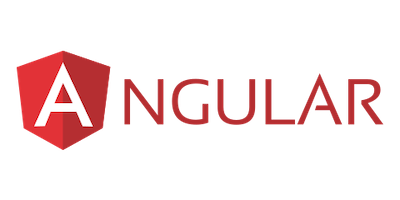
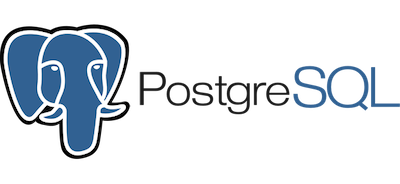
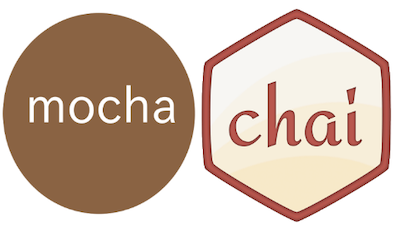
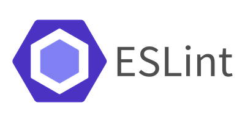
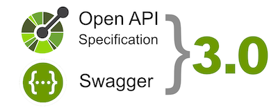

# Choix des Technologies

## Backend

- Language : `TypeScript`
- Runtime Environment: `Node Js`
- Framework : `NestJs`
- ORM : `TypeOrm`

Tout d'abord, vu l'envergure du projet, il me parait important de veiller à une bonne structure et de garder en tête la maintenance du projet au fil du temps. Dans ces circonstances, il est important d'utiliser un framework.
Quant au choix du framework, dans un premier temps mon choix s'est porté sur la suite NodeJs-ExpressJs. Ce choix était initialement justifié par le faite que j'avais déjà travailler avec ceux-ci. Après quelques semaines de développement, je me suis rendu compte que je préférait nettement utiliser le TypeScript pour un projet d'une tel envergure. J'ai des lors décidé de changer de framework et ai migré mon application NodeJs-Express vers du NestJs. Le NestJs utilise du Typescript et permet de bien structurer son code comme au frontend avec Angular. 

## Frontend

- Framework : `Angular` avec comme languages :
  - `TypeScript`
  - `HTML`
  - `SCSS`

Tout comme pour le backend, il est évident que l'utilisation d'un framework est indispensable. 
Le choix du framework s'est fait sur base de mon expérience personnelle. En effet, durant mes années d'études, j'ai eu l'occasion d'utiliser différent frameworks frontend tel que React, Vue et Angular. J'ai particulièrement bien aimé travailler avec ce dernier car il impose une certaine rigueur tout en restant relativement simple d'utilisation. 

## Base de données 

Le choix de la base de données a été motivé par quatre critères :
1. **SQL** 
    Après analyse des besoins du client, il ressort clairement un grand nombre de relations entre les différentes données.  Une base de données SQL est donc primordiale pour la bonne organisation du système d'information. 
>
2. **Notoriété** 
    PostgreSQL est fortement utilisé dans le milieu proféssionnel ce qui lui oblige d'être mise à jour régulièrement et ce tant au niveau sécurité que en ajout de fonctionnalités. C'est donc une base de données fiable, utilisable à très long terme et maîtrisée par de nombreux développeurs. 
>
3. **Expérience**
    Bien que toutes les bases de données SQL se ressemble, le fait d'avoir déjà manipuler et de s'être familiariser avec PostgreSql m'offre un gain de temps considérable. 
>
4. **Disponible sur Heroku**
    Heroku (la plateforme d'hébergement choisie) offre la possibilité d'intégrer directement une base de données PostgreSql à notre application. Ceci simplifie énormément le déploiement ainsi que l'intégration de celle-ci avec l'application. 
   
## Tests

Afin de tester l'application, j'utilise le framework `Mocha` en combinaison avec `Chai`.
Mocha permet d'exécuter les tests et renvoie un log du résultat. Chai quant à lui permet de structurer mes fichiers de tests.  

## Linter

Il est "facile" d'écrire du code mais beaucoup plus compliqué de le rendre cohérent, lisible et portable. Afin de palier à ces problèmes un linter est indispensable. Étant donnée que je travaille principalement avec du `JS`et du `TS`, j'ai opté pour [ESLint](https://eslint.org). Ce linter est 100% configurable pour chaque projet et me permet de garantir, dans l'éventualité où dans le future un autre développeur venait à contribuer au projet, la cohérence de nommage des variables, la configuration de l'IDE et bien d'autre choses. Pour ce qui est du `HTML` et `SCSS` un linter est inclus dans le framework Angular. 

## API

### Testing

Afin de tester les différents endpoints API de l'application, j'ai décidé d'utiliser `Insomnia`. `Insomnia` permet non seulement de tester mon API en temps réel (équivalent à Postman) mais permet aussi d'écrire la documentation néanmoins, le framework backend que j'utilise me permet de générer automatiquement et facilement une documentation API.

Programme utilisé : [Insomnia.com](https://insomnia.rest)

### Documentation 

Une API sans documentation est pratiquement inutilisable. Il existe un grand nombre de technologies pour écrire de la documentation API. Néanmoins, afin de centraliser un maximum d'éléments, j'ai décidé d'utiliser un plugin pour NestJs. Ce plugin [(@nestjs/swagger swagger-ui-express](https://docs.nestjs.com/openapi/introduction)) me permet de générer automatiquement la documentation de mes endpoints sur base de quelques décorateurs (code non-essentiel au fonctionnement de l'application mais permettant d'écrire des annotations) ajouté dans le code. En plus de cela, il me permet de de déployer cette documentation directement avec l'application. Ainsi, vous pouvez  la consulter ici : https://slg-app.herokuapp.com/api-docs/ .

## Schémas / Design

Pour tout ce qui est schéma de base de données, création de logo ou maquette de fonctionnalités j'utilise :
- [sqldbm](https://app.sqldbm.com/) : création de schémas de base de données (sql)
- [Figma](https://www.figma.com/files/recent) : design et autre  