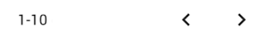

## Main d'oeuvres (MO)

<!--us-->
<!--title-->
### (MO01) Onglet Main d'oeuvres
<!--/title-->
<!--description-->
> En tant qu'utilisateur j'aimerais avoir un onglet `Main d'oeuvres` afin de pouvoir y gérer tout ce qui concerne les différents types de main-d'oeuvres. 

#### <u>📌 Préconditions :</u>
- **Technique :**
  <!--checklist: "📌 Préconditions technique"-->
  - Une barre de navigation doit être implémentée.
  <!--/checklist-->
- **Logique :**
  - /

<!--/description-->
<!--/us-->

---

<!--us-->
<!--title-->
### (MO02) Consulter la liste des main d'oeuvres
<!--/title-->
<!--description-->
> En tant qu'utilisateur j'aimerais pouvoir consulter une liste des différents tarifs de main d'oeuvres afin de pouvoir visualiser le coût par heure de ceux-ci.

#### <u>📌 Préconditions :</u>
- **Technique :**
  <!--checklist: "📌 Préconditions technique"-->
  - table `Workforce` doit exister dans la DB.
  <!--/checklist-->
- **Logique :**
  - /

#### <u>📋 Détail :</u>
Quand l'utilisateur clique sur l'onglet `Workforce` de la barre des menus, une requête `GET` est envoyée à l'API afin de récupérer les 25 premiers éléments de la table: 

```json
method  : GET
url     : /api/workforces?show=0-24
```

En attendant la réponse du serveur, la page est chargée avec :

- la structure du tableau (les headers)
- un spinner à la place des données 

✅ Si la requête abouti avec succès: les données sont chargées dans le tableau

❌ Si la requête échoue: un message d'erreur est affiché

S'il existe plus de 25 éléments, des petites flèches en dessous du tableau permettent de charger les 25 éléments suivants et ensuite remplacer les lignes du tableau existant par les "nouveaux" éléments. 
Un compteur se trouvant à gauche des deux flêches permet de savoir la plage de produits actuellement affichée.

**exemple :**
<!--img-->

<!--/img-->

#### <u>🔍 Critères de validation :</u>
<!--checklist: "🔍 Critères de validation"-->
- Un utilisateur peut consulter une table reprenant toutes les mains d'oeuvres, chaque ligne de la table correspond à une main d'oeuvre.
- Si aucune main d'oeuvre existe, l'utilisateur voit un message indiquant qu'aucune main d'oeuvre n'a été trouvée et ce à la place du contenu de la table.
<!--/checklist-->

<!--/description-->
<!--/us-->

---

<!--us-->
<!--title-->
### (MO03) Ajouter un nouveau tarif de main d'oeuvre
<!--/title-->
<!--description-->
> En tant qu'utilisateur j'aimerais pouvoir ajouter un nouveau tarif de main d'oeuvre afin d'avoir des tarifs spécifique à chaque type de travail. (mécanique, tôlerie, peinture, ...)

#### <u>📌 Préconditions :</u>
- **Technique :**
  <!--checklist: "📌 Préconditions technique"-->
  - table `Workforce` doit exister dans la DB.
  <!--/checklist-->
- **Logique :**
  - /

#### <u>📋 Détail :</u>
Quand l'utilisateur clique sur le bouton `new workforce` un formulaire contenant les champs ci-dessous s'ouvre :

  - nom: `Text` `required`
  - tarif (HT): `Number` `required`
  - tarif (TTC): `Number` 
  - Note: `Text`
  - Add : `Button`
  - Cancel : `Button`

Tous les champs de type `Number`sont initialisé à 0 par défaut.

Quand l'utilisateur clique sur le bouton *Add* une requête `POST` est envoyé à l'API afin de tenter d'ajouter le nouveau tarif de main d'oeuvre :

```json
method  : POST
url     : /api/workforces
body    :
{
    "name": "...designation...",
    "price_HT": 0,
    "price_TTC": 0,
    "note": "...note..."
}
```

✅ Si aucune main d'oeuvre n'existe déjà avec le même nom alors:
  - La main d'oeuvre est ajoutée dans la base de données.
  - Un message de couleur vert indiquant la réussite de l'ajout apparaît sous les boutons.
  - Après une courte durée (1-2sec) le formulaire est fermé. 

❌ Si la main d'oeuvre existe déjà ou si une autre erreur survient:
  - La main d'oeuvre n'est pas ajoutée dans la base de données!
  - un message d'erreur de couleur rouge spécifiant le problème, apparaÎt sous les boutons. 

#### <u>🔍 Critères de validation :</u>
<!--checklist: "🔍 Critères de validation"-->
- Un utilisateur peut ajouter une nouvelle main d'oeuvre.
- Une main d'oeuvre ne peut être ajoutée si une main d'oeuvre portant le même nom existe déjà. 
<!--/checklist-->

<!--/description-->
<!--/us-->

---
