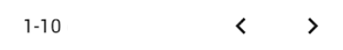

## Factures (FA)

<!--us-->
<!--title-->
### (FA01) Onglet Factures
<!--/title-->
<!--description-->
> En tant qu'utilisateur j'aimerais avoir un onglet `Factures` afin de pouvoir y gérer tout ce qui concerne les factures.

<!--/description-->
<!--/us-->
---
<!--us-->
<!--title-->
### (FA02) Consulter les factures 
<!--/title-->
<!--description-->
> En tant qu'utilisateur j'aimerais pouvoir consulter une liste des factures sous forme d'un tableau afin d'avoir un résumé des informations de chaque facture. 

#### <u>📌 Préconditions :</u>
- **Technique :**
  <!--checklist: "📌 Préconditions technique"-->
  - table `Facture` doit exister
  <!--/checklist-->
- **Logique :**
  - /

#### <u>📋 Détail :</u>
Quand l'utilisateur clique sur l'onglet `factures` de la barre des menus, une requête `GET` est envoyée à l'API afin de récupérer les 25 dernières factures: 

```json
method  : GET
url     : /api/invoice?show=25
```

En attendant la réponse du serveur, la page est chargée avec :

- la structure du tableau (les headers)
- un spinner à la place des données 

✅ Si la requête abouti avec succès: les données sont chargées dans le tableau

❌ Si la requête échoue: un message d'erreur est affiché

S'il existe plus de 25 factures, des petites flèches en dessous du tableau permettent de charger les 25 factures suivantes et ensuite remplacer les lignes du tableau existant par les nouvelles factures. 
Un compteur se trouvant à gauche des deux flêches permet de savoir la plage de factures actuellement affichée. 

**exemple :**
<!--img-->

<!--/img-->

#### <u>🔍 Critères de validation :</u>
<!--checklist: "🔍 Critères de validation"-->
- Un utilisateur peut consulter une table reprenant toutes les factures, chaque ligne de la table correspond à une facture.
- Si aucune facture n'existe, l'utilisateur voit un message indiquant qu'aucune facture n'a été trouvée et ce à la place du contenu de la table.
<!--/checklist-->

<!--/description-->
<!--/us-->
---

### (FA03) Consulter le détail d'une facture
> En tant qu'utilisateur j'aimerais pouvoir consulter le détail d'une facture afin de pouvoir prendre connaissance de son contenu.
  
---

### (FA04) Télécharger la facture en pdf
> En tant qu'utilisateur j'aimerais pouvoir télécharger une facture sous format pdf afin de pouvoir l'enregistrer sur mon ordinateur. 
  
---

### (FA05) Rechercher une facture
> En tant qu'utilisateur j'aimerais pouvoir rechercher une facture sur base de son numéro, du client(nom, prénom) ou du véhicule (marque, modèle, imat.) afin de pouvoir retrouver plus facilement une facture spécifique.
  
---

### (FA06) Trier les factures
> En tant qu'utilisateur j'aimerais pouvoir trier les factures sur base de la date d'émission, du client ou du véhicule afin de pouvoir cibler les groupes de factures qui m'intéressent.
  
---
