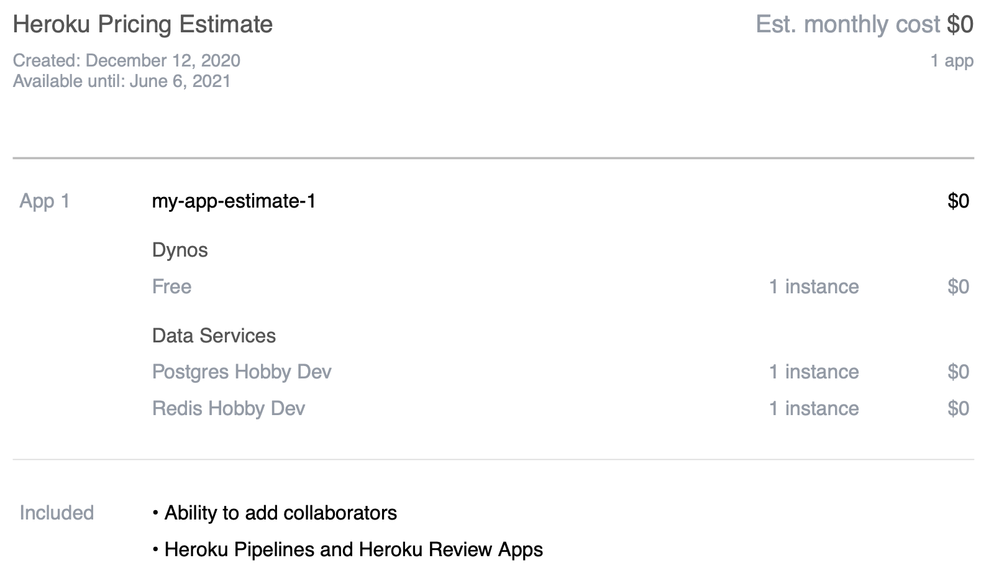
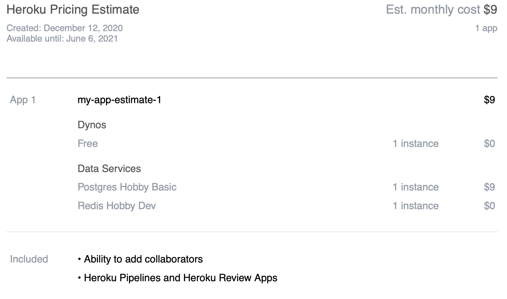
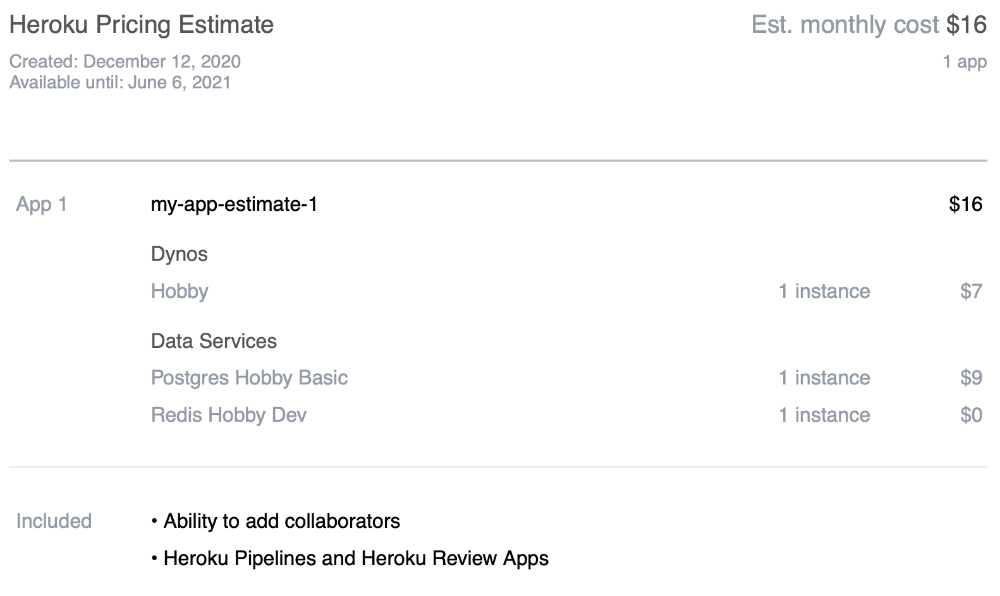

# Hébergement de l'application

## Avant-propos
Il existe de nos jours une multitude de solutions afin d'héberger une application web. Toutes les solutions offrent divers avantages et inconvénients, aussi bien d'un point de vue technologique que financier. Afin de ne pas s'encombrer avec une quantité importante de possibilités, j'ai sélectionné 3 options qui me paraissent les plus adéquates :

- Serveur local
- [Heroku](https://www.heroku.com/home)
- [Microsoft Azure](azure.microsoft.com)
  
Dans le cadre de ce projet, il est important de préciser les points suivant :
- le client n'a **pas d'informaticien** à temps pleins
- le client souhaite **limiter les dépenses** au maximum
- le **traffic** vers l'application sera **faible** car utilisé uniquement par une ou deux personnes et pendant 2-3h par jour maximum
- dans le futur, un web-shop pourrait être intégré à l'application et donc générer un traffic plus important -> **évolutivité** 

La solution doit pouvoir :
- Héberger une application NodeJs
- Héberger une base de données SQL

(Idéalement les deux services sont hébergé sur la même plateforme mais ce n'est pas obligatoire.)

## Solutions

### Serveur Local
#### Description 
Le client utilise actuellement un serveur tournant sous Windows 10 pro. Ce serveur fait tourner leur programme de gestion mais sert également d'ordinateur "classique" pour tous les employés. Notons qu'aucun système de backup automatique n'est mis en place.
La base de données inclue dans leur programme de gestion devant être accessible depuis le site de la carrosserie, une règle de port-forwarding est mise en place dans le firewall de leur routeur. 

#### ✅ Avantages
- Coût négligeable car infrastructure existante
- Maîtrise totale des données
  
#### ❌ Inconvéniants
- Os du serveur inadapté (Windows 10 pro)
- Maintenance plus compliqué à mettre en place
- Scalability (évolutivité) compliquée voir impossible sans investissement conséquent
- Déploiement continue plus complexe à mettre en place
- Accessibilité extérieur require plus de sécurité
- Nécessite la mise en place d'une meilleur gestion des backups
- Pas de redondance 

#### 💰 Prix
L'infrastructure physique déjà existante et l'utilisation de software gratuit et open-source tel qu'Apache, PostgreSql, fail2ban,... rendraient les coûts négligeables. 

**Coût estimé en production: `0 €/mois`**

#### Conclusion 
Au vu des nombreux désavantages, je pense que cette solution, bien que peu coûteuse, ne soit pas envisageable. 

---

### Heroku 
#### Description 
Heroku est un `PaaS`(Platform as a Service) fortement utilisé de par sa simplicité et sa compatibilité avec des languages modernes tel que Node, Ruby, Python et bien d'autres. 

Bien que souvent utilisé pour des projets de petite à moyenne taille, certaines grandes entreprises comme `Totyota Europe` ou `Dubsmash`l'utilisent également. 

#### ✅ Avantages
- Intégration très facile avec git
- Entièrement gratuite pour le développement 
- Inclus une base de données PostgreSql
- Coût en production fixe 
- Maintenance facile et accessible à distance
- Portabilité élevée: il est très facile d'arrêter le service de de migré vers une autre solution. Le code n'est pas lié à Heroku
- Expérience: j'ai déjà plusieurs fois eu l'occasion de travailler avec Heroku, je connais donc assez bien la plateforme et la façon de travailler avec
- Métrics inclus
- [Sécurité](https://www.heroku.com/policy/security) 

#### ❌ Inconvéniants
- Scalabilité moyenne car il faut changer de plan tarifaire en fonction du traffic
- Gestion de la base de données moins facile (pas de rôle différents)
- Cold-starts d'une à deux minutes du site-web (uniquement avec la version gratuite)

#### 💰 Prix
Fonctionne sur base de plans tarifaire prédéfinit mais modulable.
En fonction des besoins du client, j'ai sélectionné 4 plans tarifaire:

1. **Hobby - Gratuit**
    > Ce plan tarifaire offre pratiquement toutes les fonctionnalités dont nous avons besoin. Nous serons néanmoins restraint par le nombre de requêtes, la taille de la base de données, les cold-starts, ... 
    Cette solution me semble plus que suffisante durant le développement de l'application et pourquoi pas durant les premièrs mois ou premières années d'utilisation. 
    ❗️ Attention, la DB gratuite est limitée à 10K lignes...

    
    Pour consulter les détail de ce plan, cliquez [ici](https://www.heroku.com/pricing/estimates/80f7a96a5c962ed6c8ff33bba51b03895cecc0c6ac6d890612bda22105a0bfdc).
    >
1. **Hobby - Basic**
    > Ce plan tarifaire est identique au précédent sauf que la DB peut accueillir 10M de lignes. 

    
    Pour consulter les détail de ce plan, cliquez [ici](https://www.heroku.com/pricing/estimates/80f7a96a5c962ed6c8ff33bba51b03895cecc0c6ac6d890612bda22105a0bfdc).
    >
2. **Hobby Avancé**
    > Ce plan tarifaire est à peu de choses prêt équivalent au plan gratuit. Il permet néanmoins de supprimer complètements les cold-starts. Il offre également un les métriques du site pour les dernières 24h.

    
    Pour consulter les détail de ce plan, cliquez [ici](https://www.heroku.com/pricing/estimates/79d7c0dde0c9581c6d9e904dfc83b475ea27a04bc6d15a2044e9e9808a8b2279).
    >
3. **Production**
    > Cet plan offre tout ce que les plans précédents offraient mais augmente considérablement les capacité de gestion de traffic, augmente la taille maximale de la base de données, offre des métriques détaillées aussi bien pour la base de données que pour le site-web, permet des roll-backs sur une période de 7 jours.

    
    Pour consulter les détail de ce plan, cliquez [ici](https://www.heroku.com/pricing/estimates/e2ef73be146baeb33b666fb7b01e9bb01c74210891294008f4e5237d3d5ccdb9).
    >

#### Conclusion 
En conclusion, je pense qu'il est possible de partir dans un premier temps sur le plan tarifaire n°2. Néanmoins le jour où un web-shop est ajouté à l'application, il faudra probablement passer sur un autre plan tarifaire tel que le n°3. 

En plus du coût du plan n°2, il est bon de prendre une petite marge de sécurité afin de ne pas être surpris lors d'éventuels coûts supplémentaires tel qu'un nom de domaine, un autre certificat SSL,... 

**Coût estimé en production: `18 €/mois`**

---

### Microsoft Azure 
#### Description 
Microsoft Azure est un des leaders dans le domaine des `cloud service providers`. La plateforme offre plus de 200 produits couvrant une multitudes de domaines allant de la location de resources de calculs pour du Machine Learaning à l'hébergement de base de données en passant par la gestions de conteneurs Docker. 

Microsoft Azure est utilisé par un très grands nombre d'entreprises tel que `3M`, `Airbus`, `Avid`, `BMW` et bien d'autres. 

#### ✅ Avantages
- Scalabilité extrêmement performante 
- Compartimentation de chaque service
- Documentation et communauté très active
- Grandes flexibilité de configuration
- Maintenance facile et accessible à distance
- Métrics inclus
- Sécurité 

#### ❌ Inconvéniants
- Coût très variable et difficile à prévoir à l'avance
- Complexe à configurer correctement 
- Plus de choses à configurer manuellement
- Je n'ai aucune expérience

#### 💰 Prix
A l'inverse de Heroku, Azure ne fonctionne pas sur base de plans tarifaire spécifique mais fonctionne sur base du principe `Pay-as-you-go`. Le coût dépend donc fortement du traffic, de la taille de la base de données, de la taille des requêtes etc. 

- **Service Web :**
    Hébergement de l'app sur une machine Linux :
    - version gratuite pendant 12 mois
    - version payante : **11.081€/mois**

    Pour plus de détails, cliquez [ici](https://azure.microsoft.com/en-gb/pricing/details/app-service/linux/)

- **Base de données :**
    - 5GB (5GB étant le minimum configurable) d'espace de stockage à 0.1155€/GB/mois soit : **±5.8€/mois**
    - 1 vCore à 0.4840€/heure, si utilisation 2h/j -> 60h/mois soit : **±29€/mois**
    Pour plus de détails, cliquez [ici](https://azure.microsoft.com/en-gb/pricing/details/sql-database/single/)

**Coût estimé en production: `50 €/mois`**

#### Conclusion 
Bien que Microsoft Azure offre une très grande flexibilité et environnement très professionnel, le coût semble fort élevé et pas très compétitif pour une application de cette envergure. Néanmoins, le jour où un web-store est ajouté, cette solution peut être retenue! 

## Choix retenu 
Après discussion avec le client, le solution retenue est `Heroku` car celui-ci permet une meilleur maîtrise des coût et offre une option entièrement gratuite très attrayante. 